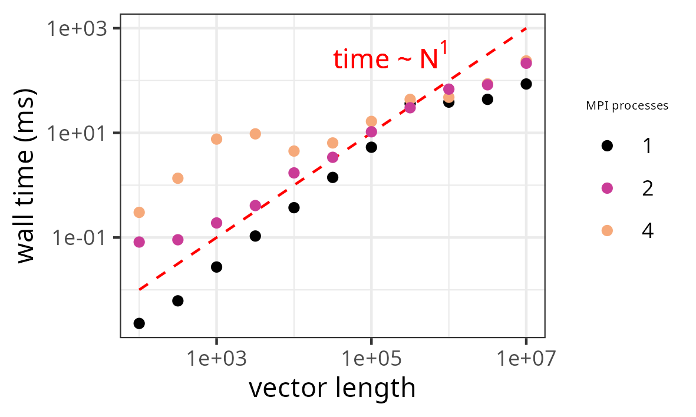
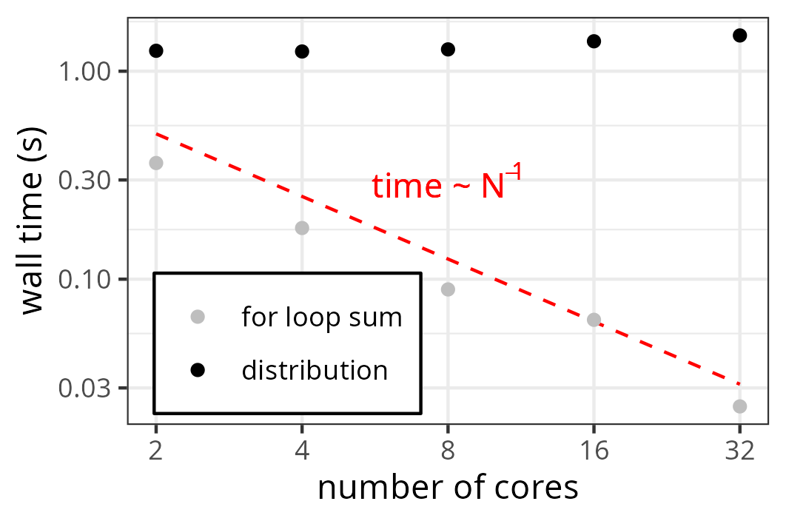
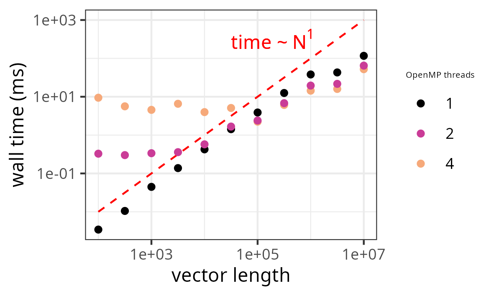
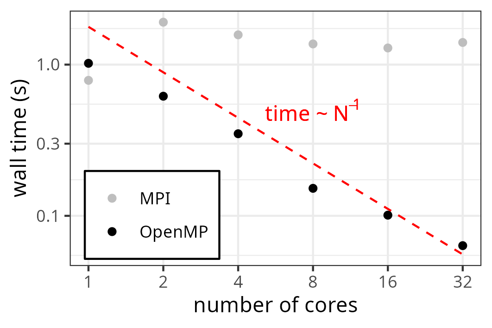

# Parallel Computing with CPU

The programme can be executed by running the `$ ./run.sh` executable. This bash script automatically reads the necessary parameters, compiles the C++ code and executes the MPI and OpenMP programmes.  
You can change the parameters in the **config** file as desired. These parameters include the number of parallel processes/threads to be used. The script is adjusted to a laptop with 4 logical but 2 physical cores and may have to be adjusted to your own specifications.  
Additionally, the length of the vector *N* has to be divisible over the number of cores *c*. The script has not been tested otherwise and may not work properly.  
  
The full code can be found on [GitHub](https://github.com/ksimoens/Scientific-Computing/tree/master/Task009_parallel_CPU).

## Message Passing Interface (MPI)

### Installation, Compilation and Execution

To be able to compile and run MPI code on Ubuntu, you have to install two Ubuntu libraries:

```
$ sudo apt install libopenmpi-dev
$ sudo apt install openmpi-bin
``` 

The first library ensures the installation of the MPI C/C++ compiler `mpic++` and the second library creates the **mpi.h** library file, which contains all the necessary MPI functions.  
  
To compile a programme containing MPI processes, simply replace the standard compiler statement with the MPI one:

```
$ mpic++ -c main.o main.cpp
$ mpic++ -o main.o main
```

You can then run the executable **main** by:

```
$ mpirun -np 4 main
```

where 4 indicates the number of processes that will be spawned by MPI.  
The example in this exercise will be run on the 4 cores of a single laptop. There is a 'problem' however.  
When you check the specifications of your processor:

```
$ cat /proc/cpuinfo  | grep 'name'| uniq
$ model name	: Intel(R) Core(TM) i5-7200U CPU @ 2.50GHz
```  

you can look up the number of cores in the CPU. In this case, the number of logical cores is:

```
$ egrep '^processor' /proc/cpuinfo | sort -u | wc -l
$ 4
```

while the number of physical cores is:

```
$ egrep '^core id' /proc/cpuinfo | sort -u | wc -l
$ 2
```

due to hyperthreading.  
The MPI only 'sees' the physical cores and will therefore generate an error message when asked to create 4 processes:

```
$ mpirun -np 4 main
$ --------------------------------------------------------------------------
$ There are not enough slots available in the system to satisfy the 4
$ slots that were requested by the application:

```

It is possible to force MPI to use all the logical cores instead by using the `--use-hwthread-cpus` option:

```
$ mpirun --use-hwthread-cpus main
```

### Vector Sum

The vector sum using MPI is performed in **main.cpp** in the **MPI** directory. Additionally, the elements of the resulting vector are summed.  
  
The MPI processes are created with `MPI_Init()`.
Only the root process fills the global vectors with their elements. Next, the root process performs the vector sum and subsequent element-wise sum serially in order to test the final results and compare the wall time of the two calculations (serial versus parallel).  
To set up the parallel summations, local vectors are created for each MPI process and the global vectors are distributed over the local ones using `MPI_Scatter()`.  
Each process then performs its local summations.  
The local results are then collected into the global vector using `M̀PI_Gather()`. The element-wise sum is performed by reducing the local element-wise sums through `MPI_Reduce()`.  
Finally, the root process summarises the results and prints them to the terminal.  
  
The results from the serial and the parallel calculations are not identical, but they are equal up to machine precision.  
Looking at the passed wall time (using `MPI_Wtime()`) shows that for these calculations, the serial computation outperforms the parallel computation. The overhead from distributing the vectors over the different processes is never compensated by the gain in doing the calculations in parallel. It is important to emphasise that for the wall time of the serial computation, only the single for loop with the summations is counted, while for the parallel computation, also the scattering and gathering of the vectors is taken into account.  
The results can be summarised in this graph:

<p align="center">

</p>

The more processes, the slower the calculation becomes, which clearly shows how the distribution of data between the processes is the bottleneck. All three curves show a relatively linear dependence on the length of the vector. For short vectors, the distribution of data starts to display uncontrolled behaviour as visisble in the jump in wall time for 4 processes around 10,000 elements.  
Another way to show this idea is to run the programme with various number of processes, which is done on the 32-core CloudVeneto computer of our research group. Now, we time the distribution and collection of memory over the processes separately from the actual for loops that do the summation locally. We use a fixed vector length of 1e8 elements.

<p align="center">

</p>

The for loop scales inversly linearly with the number of cores as the number of operations scales in this way. However, the distribution of the data is fairly independent only slightly rising with the number of processes. Given the absolute values of the times, the distribution will always dominate the overall elapsed wall time. The MPI structure will only become useful when the operations performed by the processes are more evolved and can run longer without communication with the other processes. 
  
As the vectors are distributed over the processes, memory does not become an issue, even for a vector of length 1e7. The command `/usr/bin/time` can be used to monitor the elapsed time and the memory usage of a programme:

```
$ /usr/bin/time -v mpirun --use-hwthread-cpus main
$ 	Command being timed: "mpirun --use-hwthread-cpus main"
$	User time (seconds): 2.69
$	System time (seconds): 0.83
$	Percent of CPU this job got: 268%
$	Elapsed (wall clock) time (h:mm:ss or m:ss): 0:01.31
$	Average shared text size (kbytes): 0
$	Average unshared data size (kbytes): 0
$	Average stack size (kbytes): 0
$	Average total size (kbytes): 0
$	Maximum resident set size (kbytes): 387332
$	Average resident set size (kbytes): 0
$	Major (requiring I/O) page faults: 3
$	Minor (reclaiming a frame) page faults: 145991
$	Voluntary context switches: 6527
$	Involuntary context switches: 443
$	Swaps: 0
$	File system inputs: 0
$	File system outputs: 136
$	Socket messages sent: 0
$	Socket messages received: 0
$	Signals delivered: 0
$	Page size (bytes): 4096
$	Exit status: 0
```

The *Maximum resident set size* output indicates the peak RAM usage of the programme (here: 378 Mb).  
We can estimate the amount of memory that is required with this vector length. Using the *double* type, each element takes 8 bytes. We declare 4 global vectors of size N in the root process. We also declare 3 local vectors of size N/4 for all 4 processes. This then becomes \[(N x 4) + (N / 4 x 3 x 4)\] x 8 = 56N bytes ~ 534 Mb. This discrepancy with the measured value could be explained by the fact that the `/usr/bin/time` metric only looks at the root process, which eleminates a factor 4 in the second term and results in 38N bytes ~ 362 MB. In any case, these calculations are no problem for a 8.2 GB RAM.  
It is also interesting to note the CPU percentage of 268 percent. If all 4 processes were doing calculations all the time, this number should be 400 percent. Given the serial calculations and the data distribution, which is inherently serial, this perfect number can never be attained. As a comparison, the CPU percentage for the vector sum of vectors with length 1,000 is 104 percent. This again illustrates that there is very little to gain with MPI parallellisation for short vectors.

## Open MultiProcessing (OpenMP)

### Installation, Compilation and Execution

OpenMP is a feature of the compiler and is therefore readily available with most standard C/C++ compilers.  
To use certain OpenMP functions, the library **omp.h** has to be included in the programme.  
To compile a script with OpenMP directives, use the compiler flag `-fopenmp`:

```
$ g++ -fopenmp -c main.o main.cpp
$ g++ -fopenmp -o main.o main
```

Running the programme can be done in the usual way: `$ ./main`.

### Vector Sum

The structure of the programme is very similar to the one for the MPI and can be found in the **main.cpp** script in the **OpenMP** directory.  
First the vectors are created and filled. Next, the daxpy vector sum and the element-wise sum are performed serially.  
OpenMP is then used to perform these sums in parallel by using the `#pragma` decorator. The daxpy vector sum is done by adding:

```
#pragma omp parallel for
```

to the for loop. The element-wise sum can be obtained by reduction:

```
#pragma omp parallel for reduction (+:sum_parall)
```

where `sum_parall` holds the final scalar sum value.  
As before, different parts of the run are timed.  
The programme finally prints out the statistics to the terminal.  
  
The results from the serial and the parallel calculations are not identical, but they are equal up to machine precision.  
As for the MPI, the timings can be graphically represented:

<p align="center">

</p> 

Now, the parallel calculations are superior to the serial ones, at least when the length of the vectors is large enough. For shorter vectors, the cost of establishing the different threads again starts to dominate and the serial programme becomes faster. The more threads you set up, the longer the vector has to be to beat the serial calculations. Once the vector is long enough, the OpenMP programme scales linearly with the vector length.  
  
As for the MPI, we can also check the memory usage of the OpenMP programme:

```
$ /usr/bin/time -v ./main
$	Command being timed: "./main"
$	User time (seconds): 0.43
$	System time (seconds): 0.22
$	Percent of CPU this job got: 144%
$	Elapsed (wall clock) time (h:mm:ss or m:ss): 0:00.45
$	Average shared text size (kbytes): 0
$	Average unshared data size (kbytes): 0
$	Average stack size (kbytes): 0
$	Average total size (kbytes): 0
$	Maximum resident set size (kbytes): 316320
$	Average resident set size (kbytes): 0
$	Major (requiring I/O) page faults: 1
$	Minor (reclaiming a frame) page faults: 78291
$	Voluntary context switches: 5
$	Involuntary context switches: 163
$	Swaps: 0
$	File system inputs: 448
$	File system outputs: 0
$	Socket messages sent: 0
$	Socket messages received: 0
$	Signals delivered: 0
$	Page size (bytes): 4096
$	Exit status: 0
```

The OpenMP programme has a peak-memory usage of 309 MB.  
We now only allocate 4 (shared) vectors of length N (here again 1e7), which comes down to: (4 x 8 x N) = 32N bytes ~ 305 MB.  
The CPU efficiency is relativly low (144 percent), but the serial calculations are also included in this number. For N=10000, this percentage drops to 100 percent and we are essentially running things in serial for the entire run, while having the useless overhead of creating 4 threads.

## MPI and OpenMP comparison

On the CloudVeneto computer of the group, both parallel programmes are run for a different number of processes/threads keeping the vector length constant (1e8). The result is:

<p align="center">

</p> 

Again, we see that the MPI is unable to reach its full potential, probably because the calculations that are actually run in parallel are too simple. However, the OpenMP implementation surprisingly scales linearly with the number of cores up to 32 cores. This means that running the programme with 32 threads is 32 times faster than the serial calculation, and the overhead of creating 32 threads is not dominating.  
Consequently, for this simple daxpy vector sum, OpenMP is to be preferred over MPI. However, the parallel calculation will only be superior to the serial one for vectors of sufficient length, which will depend on the number of threads that are used. 